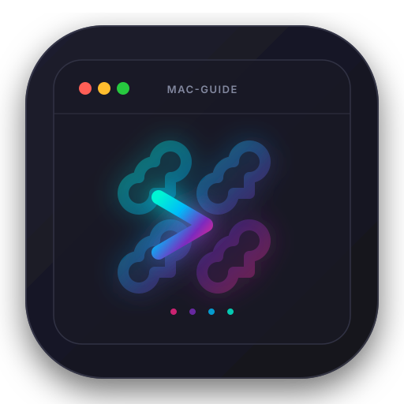

<div align="center">

  

  # macOS 现代全景调教指南
  ### Modern macOS Power-User & Everyday Guide

  <p><b>从小白日常避坑到硬核极客工作流，一份成体系、有主见、现代化的 macOS 实践手册</b></p>

  <p>
    <a href="https://linux.do"></a>
    
    
    
    
  </p>

  <p>
    <a href="#-全景文档导航"><strong>探索文档</strong></a> •
    <a href="#-核心设计哲学"><strong>核心哲学</strong></a> •
    <a href="#-快速上手路线"><strong>上手路线</strong></a> •
    <a href="https://linux.do"><strong>Linux.do 讨论区</strong></a>
  </p>

</div>

---

## 🌟 为什么写这份指南？

长期以来，无论是在中文社区还是海外论坛，关于 macOS 的深度配置资料都面临着严重的**两极分化与碎片化**：

- **普通用户与新手到处踩坑**：充斥着铺天盖地的营销号推荐与收费高昂的流氓清理软件；而关于“外接显示器字体发虚”、“移动硬盘 NTFS 无法写入”、“解压 Windows 压缩包中文乱码”、“没有剪切键”等高频痛点，始终缺少一份保姆级闭环指南。
- **进阶开发者与极客缺乏系统参考**：很多从 Linux（特别是 Arch Linux / Hyprland / Niri / i3）转到 Mac 的用户，面对系统默认缓慢的窗口动画、生硬的外接鼠标滚轮、打架的快捷键和复杂的权限模型往往感到无所适从。
- **大量网文严重过时**：许多攻略停留在十年前的 Intel 架构时代（旧版 Yabai 关 SIP、Soundflower 虚拟声卡、各种第三方破解驱动），在现代 Apple Silicon 与最新 macOS（Sonoma / Sequoia）下早已失效甚至引发系统崩溃。

**这份指南的目标是打破一切割裂**：无论你是刚入手第一台 MacBook 的大学生、日常办公文职、影视与摄影创作者，还是重度键盘流程序员，都能在此找到**兼具系统稳定性与极致生产力的现代最佳实践**。

---

## 💡 核心设计哲学

```
   ┌─────────────────────────────────────────────────────────────┐
   │                     mac-guide 设计基石                      │
   └──────┬───────────────────────┬───────────────────────┬──────┘
          │                       │                       │
 ┌────────┴────────┐     ┌────────┴────────┐     ┌────────┴────────┐
 │ 🛡️ 零安全妥协   │     │ ⚡ 极速与原生   │     │ 📜 声明式复现   │
 │ 坚决不关 SIP    │     │ GPU硬件加速终端 │     │ Brewfile 一键   │
 │ 保留原厂安全    │     │ 淘汰DockerDesktop│     │ Chezmoi配置同步 │
 └─────────────────┘     └─────────────────┘     └─────────────────┘
```

1. **全场景人群覆盖**：从纯新手开箱习惯重塑、外接硬件排坑、多媒体视听与游戏，到高阶平铺桌面和现代 CLI 工具链无缝衔接；
2. **绝对安全与原生标准**：全面基于 Apple Silicon 硬件与现代 macOS 体系，**坚决不破环 SIP（系统完整性保护）**，保障硬件级安全与系统稳定性；
3. **拥抱纯净开源，杜绝流氓软件**：坚决唾弃充斥后台弹窗与高额订阅费的商业清理工具，全面选用社区久经考验的高口碑开源方案；
4. **坚持声明式（Declarative）与可复现**：环境配置皆有迹可循、一条命令快速拉起，彻底告别“换机重装配置整整两天”。

---

## 📖 全景文档导航

全部 32 篇深度实战文档均位于 [`docs/`](./docs/index.md) 目录，结构如下：

### 第一部分：新手起步、日常办公与多媒体

| 模块 | 核心文档 | 亮点与解决痛点 |
| :--- | :--- | :--- |
| **00. 新手入门** | [概念重塑与避坑指南](./docs/00-beginner-guide/windows-to-mac.md)<br>[系统初始化与安全边界](./docs/00-beginner-guide/initial-setup.md)<br>[神奇的空格键 Quick Look](./docs/00-beginner-guide/quick-look.md)<br>[日常轻量分屏 Rectangle](./docs/00-beginner-guide/window-snapping.md)<br>[解压乱码救星 Keka](./docs/00-beginner-guide/office-essentials.md) | • 红黄绿真正生命周期模型<br>• 为什么没有剪切？`Cmd+Opt+V` 移动文件<br>• 触控板三指拖移黄金设置<br>• 任何来源与 Gatekeeper 绕过<br>• 空格预览增强（代码高亮/MD/JSON）<br>• 彻底终结 Windows 压缩包中文乱码 |
| **01. 硬件外设** | [外接显示器 HiDPI 避坑](./docs/01-hardware-and-display/external-displays.md)<br>[移动硬盘 NTFS 无法写入](./docs/01-hardware-and-display/ntfs-and-disks.md)<br>[键位与外接鼠标体验修复](./docs/01-hardware-and-display/input-and-mouse.md)<br>[MacBook 电池长寿秘诀](./docs/01-hardware-and-display/battery-aldente.md) | • BetterDisplay 强开 2K/4K 原生 HiDPI<br>• 原生键盘调节第三方显示器背光/音量<br>• 跨平台 exFAT 格式化最佳实践<br>• MOS 独立控制鼠标滚轮平滑与方向<br>• AlDente 80% 物理锁电与直通供电防鼓包 |
| **02. 影音创作** | [影音播放器天花板 IINA](./docs/02-media-and-creation/video-player-iina.md)<br>[音频内录与虚拟声卡 BlackHole](./docs/02-media-and-creation/audio-routing.md)<br>[截图长截图与贴图 Shottr](./docs/02-media-and-creation/screenshot-tools.md) | • mpv 内核全格式硬解与 Liquid Retina XDR 映射<br>• 多输出设备实现电脑内部声音无损内录<br>• 极速滚动长截图、离线毫秒级 OCR 与贴图置顶 |
| **03. 输入排版** | [输入法大升级与自动切换](./docs/03-input-and-fonts/input-methods.md)<br>[字体排版与终端渲染美化](./docs/03-input-and-fonts/typography-fonts.md) | • Input Source Pro 针对特定软件秒切中英文<br>• Rime 鼠须管雾凇拼音完全离线词库<br>• 更纱黑体解决中英文等宽表格撕裂错位 |
| **04. 兼容游戏** | [Apple Silicon 玩 Windows 游戏](./docs/04-windows-and-gaming/whisky-gaming.md)<br>[虚拟机方案 UTM vs Parallels](./docs/04-windows-and-gaming/virtual-machines.md) | • Whisky + Apple GPTK (D3DMetal) 翻译层<br>• 免装虚拟机畅玩 Windows Steam 3A 游戏<br>• 开源 UTM 免费一键部署 Windows 11 ARM |
| **05. 维护存储** | [彻底卸载应用 AppCleaner](./docs/05-system-maintenance/system-cleaner.md)<br>[深度拯救“系统数据”暴增](./docs/05-system-maintenance/storage-rescue.md)<br>[defaults 命令行深度调优](./docs/05-system-maintenance/defaults-tuning.md) | • 揭露流氓清理大师谎言，AppCleaner 纯净卸载<br>• 查找并清除 Time Machine 本地快照释放几十 GB<br>• 消除 Dock 延迟、Finder 始终显示扩展名 |

### 第二部分：极客开发、现代命令行与全键盘桌面

| 模块 | 核心文档 | 亮点与解决痛点 |
| :--- | :--- | :--- |
| **06. 包管理底座**| [Homebrew 现代化管理体系](./docs/06-package-management/homebrew.md)<br>[现代运行时管理神器 mise](./docs/06-package-management/runtime-mise.md)<br>[轻量容器化方案 OrbStack](./docs/06-package-management/containers.md) | • 国内清华镜像源极速配置<br>• `Brewfile` 声明式全软件跨机一键还原<br>• 一个二进制管理 Node/Py/Go/Rust，0ms 启动<br>• 淘汰臃肿 Docker Desktop，仅耗 100MB 内存 |
| **07. 现代终端** | [GPU 加速终端 Ghostty / Kitty](./docs/07-terminal-and-cli/terminal-emulators.md)<br>[Shell 与 Starship 极速提示符](./docs/07-terminal-and-cli/shell-and-prompt.md)<br>[现代 CLI 全家桶替代表](./docs/07-terminal-and-cli/modern-unix-tools.md)<br>[终端 Rice 与 fastfetch 看板](./docs/07-terminal-and-cli/fastfetch-rice.md) | • 120Hz 高刷 Metal 渲染与 Nerd Fonts 字体<br>• 弃用臃肿 Oh-My-Zsh，启动延迟压制在 30ms 内<br>• `eza` / `zoxide` / `bat` / `ripgrep` / `delta` 全面替换<br>• 自适应宽度防爆框终端看板 `myfastfetch` |
| **08. 平铺桌面** | [免关 SIP 平铺利器 AeroSpace](./docs/08-tiling-and-desktop/aerospace.md)<br>[窗口活动边框 JankyBorders](./docs/08-tiling-and-desktop/borders-and-bar.md)<br>[效率中枢 Raycast 深度配置](./docs/08-tiling-and-desktop/launcher-raycast.md)<br>[Karabiner 与 Hyper 超级键](./docs/08-tiling-and-desktop/karabiner-hyper.md) | • **100% 免关 SIP** 的 i3 树形平铺，工作区毫秒瞬切<br>• 活动窗口彩色焦点高亮边框<br>• 替代 Spotlight，集成剪贴板/代码片段/Kill 进程<br>• Caps Lock 改造成 Hyper 键 (Cmd+Ctrl+Opt+Shift) |
| **09. 技巧维护** | [macOS 网络代理避坑指南](./docs/09-workflows-and-tricks/network-proxy.md)<br>[声明式 Dotfiles 跨机同步](./docs/09-workflows-and-tricks/dotfiles-backup.md) | • 终端 `proxy/unproxy` 函数与 TUN 虚拟网卡排坑<br>• Chezmoi 纳管全部配置，新机 5 分钟满血复活 |

---

## 🚀 快速上手路线推荐

- **我是 Mac 新手 / 刚从 Windows 换过来**：
  建议按照 `00. 新手入门` ➡️ `01. 硬件外设` ➡️ `02. 影音创作` 顺序阅读，半小时内把常用阻碍（发虚、乱码、滚轮、剪切）彻底扫清。
- **我是办公人群 / 创作者**：
  重点阅读 [Shottr 截图标注](./docs/02-media-and-creation/screenshot-tools.md)、[BlackHole 音频内录](./docs/02-media-and-creation/audio-routing.md) 与 [Keka 办公解压](./docs/00-beginner-guide/office-essentials.md)。
- **我是程序员 / Linux 极客**：
  直接跳至 `06. 包管理` ➡️ `07. 现代终端` ➡️ `08. 平铺桌面`，享受 AeroSpace + Ghostty + mise 带来的原生平铺与全键盘飞速体验。

---

## 🤝 社区讨论与共建

欢迎加入 **[Linux.do 社区](https://linux.do)** 参与讨论交流与反馈！

如果你有更好的配置思路、发现了最新 macOS 版本的系统变更，或者想补充冷门神器，欢迎提交 Issue 或 Pull Request 共建维护！

<div align="center">
  <sub>Made with ❤️ for macOS power users and newcomers alike.</sub>
</div>
