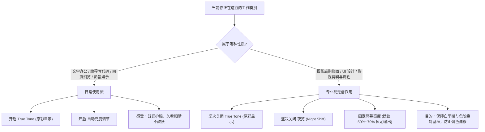

# 内置屏幕色彩调优：Color Presets 预设与色彩管理实战

每一台配备 Liquid Retina 或 Liquid Retina XDR 屏幕的现代 Mac 笔记本，在出厂时都经过了逐台的高精度硬件色彩校准。苹果的色彩管理系统（ColorSync）与 Display P3 广色域面板结合，让 Mac 拥有了行业天花板级别的显示素质。

然而，许多用户在使用中都会遇到一连串令人困惑的问题：
- **“为什么我在 Mac 上修好的照片/剪好的视频，发给朋友的 Windows 或手机看，颜色就发灰、变暗、甚至偏色？”**
- **“系统设置里那一长串显示器预设（Reference Modes / Color Presets）究竟是干嘛的？为什么切到某个预设屏幕突然变黄变暗？”**
- **“做设计和剪辑视频时，原彩显示（True Tone）和自动亮度到底该开还是该关？”**
- **“买了校色仪，可以直接给 MacBook Pro 的 XDR 屏幕校色吗？”**

本章将系统拆解 Mac 内置屏幕的硬件特性、ColorSync 色彩空间映射机制、原厂预设方案选型，以及专业工作流中的色彩校准与避坑指南。

---

## 1. 硬件面板底色：Liquid Retina vs Liquid Retina XDR

在了解色彩设置前，必须先理清你手中的 Mac 屏幕硬件到底属于哪一种规格：

| 硬件规格 | 代表机型 | 面板技术 | 峰值亮度 | 对比度 | 色彩空间 | 刷新率 |
| :--- | :--- | :--- | :--- | :--- | :--- | :--- |
| **Liquid Retina** | MacBook Air 全系、13寸 MacBook Pro、iMac | IPS LCD（边缘侧入式 LED 背光） | 500 nits（全屏） | 1,000 : 1 | 10-bit (8+FRC) P3 广色域 | 60Hz 固频 |
| **Liquid Retina XDR** | 14寸 / 16寸 MacBook Pro (M1 Pro/Max 至今) | Mini-LED（10,000+ 微米级背光分区） | 1000 nits（全屏持续）<br>1600 nits（HDR 局部峰值） | 1,000,000 : 1 | 真正原生 10-bit P3 广色域 | 120Hz ProMotion 自适应高刷 |

### 核心区别对日常与专业的影响
- **MacBook Air 的 Liquid Retina**：属于顶级广色域 IPS 屏幕。整体均匀度极佳，但由于是全局背光，黑场无法完全熄灭，对比度固定在 1000:1 左右。
- **MacBook Pro 的 Liquid Retina XDR**：采用微米级 Mini-LED 分区背光（Local Dimming）。在显示黑色时背光灯珠会完全关闭，黑位纯净度媲美 OLED，同时具备 1600 尼特爆发力的极致 HDR 渲染能力。

> [!NOTE]
> 无论是 Air 还是 Pro，出厂前苹果流水线均使用实验室级高精度光谱辐射计对其进行了逐台面板校准，校准数据直接固化在硬件固件中。

---

## 2. 世纪难题：为什么在 Mac 上看很艳，发给别人就发灰？

这是几乎所有新 Mac 用户或创作者必定会踩的大坑。根本原因在于 **色彩空间匹配（Color Space Mismatch）** 与 **Gamma 伽马曲线解释差异**。

### 2.1 Display P3 与 sRGB 的色域容积差
- **Display P3 广色域**：Mac 内置屏幕的默认硬件色域。它的色彩容积比老旧的标准 **sRGB** 大了足足 **25%**（主要在饱满的红、橙、绿区域）。
- **色彩管理机制缺失的恶果**：
  - 许多 Windows 电脑、办公显示器以及廉价安卓手机，硬件仅支持 sRGB，或者应用程序本身**不具备色彩管理能力**（无法读取图像中附带的 ICC Profile 色彩配置文件）。
  - 如果你在 Mac 上以 P3 色域导出一张图片，却没有在导出时**转换为 sRGB**：在缺乏色彩管理的 Windows 图片查看器或浏览器打开时，系统会把原本 P3 坐标轴上的数值直接生硬地塞进 sRGB 坐标轴里解释，导致色彩严重饱和度不足，呈现出**发灰、泛白、干瘪**的质感。

```
    CIE 1931 色度图原理示意：
    
    绿色顶角
       /\
      /  \       [Display P3 广色域范围]
     / /\ \      (包含更多饱满的翠绿、明黄与鲜红)
    / /  \ \
   / /sRGB\ \    [sRGB 窄色域范围]
  / /______\ \   (传统网页、Windows 默认标准)
 /____________\
红色          蓝色

* 若 P3 坐标未转换直接被按 sRGB 读取，所有饱和色彩将被压缩失真，视觉泛灰。
```

### 2.2 QuickTime 播放器的 Gamma 1.96 漂移（影视剪辑必知）
如果你在剪辑软件（如 Premiere、Final Cut Pro、DaVinci Resolve）中调好了一条 Rec.709 视频并导出，用系统自带的 QuickTime Player 打开时，可能会震惊地发现：**“暗部怎么泛白浮起来了？对比度变差了！”**

- **成因**：macOS 原生色彩引擎 ColorSync 历史上有意将标准 Rec.709（通常对应 Gamma 2.4 监视器或 Gamma 2.2 电脑屏）以 **Gamma 1.96** 进行软解补偿，试图模拟在明亮办公室光照环境下的肉眼对比度感知。
- **解法**：
  - **剪辑影视监看**：在 DaVinci Resolve 中将色彩标签设置为 `Rec.709-A`，或使用具备精准色彩色彩渲染的播放器（如 [IINA](file:///Users/mac/Projects/mac-guide/docs/02-media-and-creation/video-player-iina.md)）。
  - **网页与跨平台交付**：永远记住——在导出给网络平台（B 站、YouTube、小红书、微信网页）的内容时，**必须将色彩空间转换为 sRGB（平面图片）或 Rec.709（SDR 视频）**。

---

## 3. 系统原厂预设（Reference Modes / Color Presets）深度解析

打开 **系统设置 ➔ 显示器 ➔ 预设（Presets）** 下拉菜单，MacBook Pro (Liquid Retina XDR) 用户会看到丰富的原厂预设。这些预设绝非简单的“滤镜”，而是苹果为专业影视、摄影、平面印前定制的严格受控模式。

```
系统设置 ➔ 显示器 ➔ 预设
┌────────────────────────────────────────────────────────┐
│ Apple XDR Display (P3-1600 nits)               [默认]  │
│ Apple Display (P3-500 nits)                    [推荐]  │
│ Photography (P3-D65)                                   │
│ Internet & Web (sRGB)                          [对标]  │
│ Design & Print (P3-D50)                                │
│ HD Video (BT.709-BT.1886)                              │
│ ...                                                    │
└────────────────────────────────────────────────────────┘
```

各预设参数与最佳使用场景如下：

| 预设名称 (Preset) | 目标色域 | 白点色温 | 峰值亮度 (SDR/HDR) | 适用场景与日常建议 |
| :--- | :--- | :--- | :--- | :--- |
| **Apple XDR Display (P3-1600 nits)** | Display P3 | D65 (6500K) | SDR 可调 / HDR 1600 nits | **日常全能娱乐首选**。浏览 HDR 视频与日常办公时动态范围最大，高光极具视觉震撼力。 |
| **Apple Display (P3-500 nits)** | Display P3 | D65 (6500K) | 500 nits（锁定 SDR） | **日常平面设计/摄影修图推荐**。切断忽高忽低的 HDR 局部亮度跳变，提供恒定稳定的 500 尼特色彩基准。 |
| **Internet & Web (sRGB)** | **sRGB** | D65 (6500K) | 80 nits（标准受控暗室） | **网页开发与社交媒体内容验收**。硬件级将色域钳位（Clamp）至 sRGB，以普通消费级屏幕视角“照妖”，杜绝色差。 |
| **Design & Print (P3-D50)** | Display P3 | **D50 (5000K)** | 160 nits | **实体出版物、印刷设计专用**。白点从冷白切换为暖黄（对标印刷行业 ISO 3664 标准看样灯箱），屏幕与实体打样纸白平衡一致。 |
| **Photography (P3-D65)** | Display P3 | D65 (6500K) | 160 nits | **专业数码暗房修图**。精准锁定在专业摄影看样标准光照环境。 |
| **HD Video (BT.709-BT.1886)** | Rec.709 | D65 (6500K) | 100 nits | **广播级高清电视节目/传统影视调色**。采用 BT.1886 伽马曲线，行业标准化交付。 |

> [!TIP]
> 为什么切换到 `Design & Print (P3-D50)` 屏幕看起来特别黄？
> 很多初学者误以为屏幕发黄是“坏了”，其实并非如此。日常我们看的屏幕多为 D65（6500K 偏冷蓝光），而传统印刷纸张在 5000K 标准看样光源下呈现的是微黄白基色。D50 正是模拟这种纸张物理白平衡。

---

## 4. 原彩显示（True Tone）与自动亮度的取舍策略

在屏幕顶部“刘海”区域，苹果内置了一颗多通道环境光传感器（Ambient Light Sensor），支撑着 **原彩显示（True Tone）** 与 **自动亮度调节**。

### 4.1 原彩显示（True Tone）工作机制
- **机制**：传感器持续测量当前房间的光源色温。如果坐在白炽灯/暖光台灯下，屏幕会自动偏暖；若在正午阳光或冷白荧光灯下，屏幕会自动偏冷，让你的眼睛在看屏幕与看周围桌面时不需要频繁适应色温差，极大缓解视疲劳。
- **致命缺点**：它的工作原理等同于**实时动态篡改屏幕的物理白平衡**！

### 4.2 严格的使用场景边界



> [!WARNING]
> 如果你在开启了 True Tone 或夜览（Night Shift）的状态下修图或调色，调出的作品在别人的标准显示器上绝对会**严重偏色**（比如你的屏幕因台灯变黄，你误以为片子发黄而拼命往蓝色拉，结果导出的图在别人的冷屏上惨白发青）。

---

## 5. 高级微调校准（Fine-Tune Calibration）：为什么不要用校色仪随意覆写？

许多摄影师和极客在购买了红蜘蛛（Datacolor Spyder）或爱色丽（Calibrite Display）后，习惯性安装第三方校色软件，在 MacBook Pro 的 XDR 屏幕上直接运行“全自动校准”。

**这在 Liquid Retina XDR 屏幕上往往会导致严重翻车：屏幕对比度下降、黑位发灰、甚至高光色阶断层！**

### 5.1 为什么不要使用传统 ICC 曲线覆写？
- **传统校色逻辑**：通过校色软件向显卡输出特定色块，测量偏差后在显卡端生成一个查找表（1D LUT），强行“扭曲”显卡输出信号来迎合传感器。
- **XDR 的特殊机制**：MacBook Pro 的 Mini-LED 背光算法是由芯片内的 **Apple Display Engine** 与背光控制器协同计算的。一旦显卡输出被第三方软件强行扭曲，背光控制器的分区调光算法就会发生错位，导致光晕（Blooming）加剧或动态范围骤减。

### 5.2 正确姿势：系统原生硬件级“微调校准”
苹果从 macOS Monterey 起为 XDR 屏幕提供了专用的原生微调接口，将测量出的物理偏差直接写入系统底层，而不破坏原有平滑的 10-bit 色阶：

1. **准备高精度硬件**：使用专业分光光度计或色度计（需支持 Mini-LED 高动态范围光谱）；
2. **进入校准面板**：
   - 打开 **系统设置 ➔ 显示器 ➔ 预设**；
   - 选中需要校准的目标预设，点击下方的 **微调校准… (Fine-Tune Calibration)**；
3. **输入物理测量靶值**：
   - 输入目标与实测的白点色度坐标（$x, y$ 坐标，如 D65 标准为 $x: 0.3127, y: 0.3290$）；
   - 输入目标与实测的物理绝对亮度（$Y$ cd/m² 尼特读数）；
4. **应用保存**：
   - 系统会自动在 Display Engine 底层修正白点与增益，绝不牺牲屏幕的原生色阶平滑度与峰值亮度。

```
微调校准界面核心参数：
┌────────────────────────────────────────────────────────┐
│ 测量目标 (Target)          测量读数 (Measured)          │
│ 白点 x: 0.3127             白点 x: 0.3142  (依据仪器填入) │
│ 白点 y: 0.3290             白点 y: 0.3281               │
│ 亮度 Y: 500.0 cd/m²        亮度 Y: 494.5 cd/m²          │
│                                                        │
│                  [取消]      [应用微调]                 │
└────────────────────────────────────────────────────────┘
```

---

## 6. ProMotion 高刷与影视帧率精准对齐

搭载 ProMotion 技术的 MacBook Pro 支持最高 120Hz 的自适应刷新率，根据屏幕滑动速度实时在 24Hz ~ 120Hz 之间智能切换，既保证了如丝般顺滑的交互，又极度节省电池续航。

但在**专业影视剪辑与质检工作流**中，这种可变刷新率可能会带来微妙的画面微抖动（Micro-stutter / 3:2 Pull-down Judder）：

### 锁定影视工业标准整数倍帧率
在 **系统设置 ➔ 显示器 ➔ 刷新率** 下拉菜单中，你可以脱离 ProMotion，手动将内置屏幕锁定为工业标准刷新率：

- **48.00 赫兹 (Hz)**：完美匹配院线电影常用的 **24 fps**（1:2 整倍无抖动播放）；
- **47.95 赫兹 (Hz)**：匹配北美 NTSC 影视标准的 **23.976 fps**；
- **50.00 赫兹 (Hz)**：匹配欧标及中国电视广播常用的 **25 fps / 50 fps (PAL)**；
- **60.00 赫兹 (Hz)**：匹配通用 YouTube / B 站常规 30 fps / 60 fps 网络视频。

在做严肃的视频成片逐帧拉片与运动模糊检查时，锁定对应整数倍刷新率能让你以最严谨的硬件时钟监看成片。

---

## 7. 色彩调优最佳实践场景速查表

根据你的实际工作场景，推荐配置组合如下：

| 工作场景 | 推荐预设 (Preset) | 原彩 (True Tone) | 自动亮度 | 刷新率 | 核心注意点 |
| :--- | :--- | :--- | :--- | :--- | :--- |
| **日常码字 / 学习办公** | `Apple XDR Display (1600 nits)` 或默认 | **开启** | **开启** | `ProMotion (自适应)` | 护眼省心，自适应室内色温，减轻眼睛干涩。 |
| **日常平面设计 / UI 切图** | `Apple Display (P3-500 nits)` | **关闭** | **关闭** | `ProMotion` | 锁定 500 尼特 SDR，设计稿导出时**务必嵌入或转换为 sRGB**。 |
| **数码摄影后期 (Lightroom)** | `Photography (P3-D65)` | **关闭** | **关闭** | 默认或 ProMotion | 保证真实环境暗室修图，白平衡不发生漂移。 |
| **自媒体视频剪辑 (B站/小红书)** | `Apple Display (P3-500 nits)` | **关闭** | **关闭** | 60Hz 或 ProMotion | 导出 SDR 视频使用 Rec.709 色彩空间，避免 QuickTime 伽马漂移。 |
| **实体印前看样 (Print & Book)** | `Design & Print (P3-D50)` | **关闭** | **关闭** | 60Hz | 屏幕色温与印刷打样纸白度精准对齐，勿开任何护眼滤镜。 |
| **院线电影调色 (DaVinci)** | `HD Video (BT.709-BT.1886)` | **关闭** | **关闭** | 锁定 48Hz (针对 24p) | 消除 3:2 pull-down 抖动，符合广播电视行业标准曲线。 |

---

## 8. 总结：让好屏幕发挥真正的生产力

MacBook 的屏幕在消费级便携设备中拥有近乎无可挑剔的综合素质。普通用户只需保持原厂默认并享受原彩显示的舒适；而创作者只需遵循 **“工作时关闭动态白平衡（True Tone）、依据交付标准选择预设、导出时认清 sRGB 边界”** 这三条黄金铁律，就能彻底告别偏色与发灰，让内置屏幕成为最可靠的专业生产力利器！
