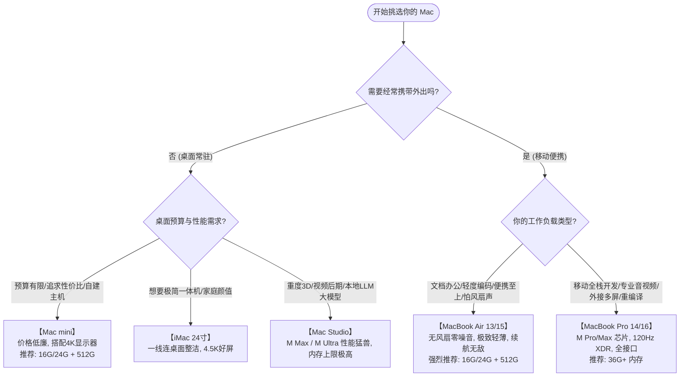

# Mac 全系列机型全景解析与选购避坑指南

买 Mac 不是买普通 PC：在 Apple Silicon 时代，**内存、硬盘、芯片全部固化焊死在主板甚至封装在晶片基板上，出厂后 100% 无法自行升级拆换**。买错配置，轻则接口带宽受限、无法外接双屏，重则性能严重腰斩或过早被淘汰。

本章系统梳理 Mac 家族的硬件产品矩阵，揭示统一内存、外接显示器、SSD 颗粒等深水区雷区，并给出精准到不同预算与使用场景的选购决策树。

---

## 1. Apple Silicon 现役硬件矩阵全览

苹果当前的产品线清晰地分为**移动便携端**与**桌面工作站端**：

| 产品线 | 定位 | 屏幕与形态 | 搭载芯片梯队 | 适合人群 |
| :--- | :--- | :--- | :--- | :--- |
| **MacBook Air** *(13 / 15 寸)* | 极致轻薄日常 | 60Hz 视网膜 Liquid 显示屏 无风扇被动散热 | 基础版 M 芯片 (M2 / M3 / M4) | 移动办公、大学生、文科研究、轻度编程、文字作者 |
| **MacBook Pro** *(14 / 16 寸)* | 移动重度工作站 | 120Hz ProMotion Liquid Retina XDR (Mini-LED) 双主动散热风扇 | 进阶与旗舰芯片 (M Pro / M Max / 基础版) | 软件开发工程师、全栈开发者、视频后期、调色师、音乐制作人 |
| **Mac mini** | 超高性价比桌面盒 | 仅主机（需自备外设） 紧凑铝金属方盒，超静音 | 基础版 M / M Pro 芯片 | 桌面办公常驻、性价比极客、自建常开无头服务器 (Home Server) |
| **iMac** *(24 寸)* | 桌面一体机 | 4.5K 视网膜极窄屏 多彩机身，随附彩色键鼠 | 基础版 M 芯片 | 前台展示、极简家庭桌面、中小学教育、门店收银设计 |
| **Mac Studio** | 专业级紧凑工作站 | 仅主机（需自备外设） 厚重铝砖机身，大风道静音风扇 | M Max / M Ultra 芯片 | 影视工业剪辑、3D 建模渲染、本地离线大模型 (LLM) 推理部署 |
| **Mac Pro** | 塔式/机架可扩展工作站 | 全塔式机箱，配备 7 个 PCIe 扩展槽 | M Ultra 芯片 | 广电系统、多通道专业音频采集卡插卡工程部署 |

---

## 2. 硬件底层关键知识与选购雷区

### 2.1 统一内存（Unified Memory）与“金子内存”真相
传统 PC 中，CPU 使用 DDR4/DDR5 主机内存，独立显卡使用 GDDR6 显存，两块区域物理隔离，数据来回搬运必须经过 PCIe 总线通道。

而在 Apple Silicon 中：
- 内存芯片与 CPU/GPU 直接贴装封装在同一块芯片基板（Substrate）上，走的是高达 **100GB/s ~ 800GB/s 的超宽总线**；
- **CPU、GPU、NPU 共享同一块物理内存池**：GPU 可以毫无拷贝代价地直接读取 CPU 载入的数据，这对机器学习（如加载 32GB 的本地大模型权重）具有毁灭性的架构级优势。

> [!WARNING]
> #### 选购警示：为什么必须唾弃 8GB 内存？
> - **现代系统负载沉重**：macOS 系统常驻、浏览器（Chromium 核心标签动辄几 GB）、微信/飞书/Slack（Electron 内存大户）以及 Docker 启动后，8GB 会在几分钟内被全部吃光；
> - **内存 Swap 与 SSD 损耗**：内存不足时，系统会疯狂将内存分页写入固态硬盘（Swap），这不仅会导致卡顿掉帧，更会让你的内置不可更换 SSD 承受每年轻易数万 GB 的无谓写入磨损；
> - **选购底线**：**2024 年以后的新设备请务必 16GB 起步**（苹果官方也终于在近年将新机型基准升级为 16GB 起）。
>   - **16GB**：轻度办公、文字处理、日常浏览、轻度代码开发；
>   - **24GB / 36GB**：专业开发（Docker 容器集群、Xcode 大工程、多开 IDE）、音视频 4K 剪辑；
>   - **48GB / 64GB+**：本地 LLM 大模型微调与量化推理、大规模并行编译、复杂 3D 场景与合成。

---

### 2.2 外接显示器限制与“黑坑”（极重要）
这是无数新购买 Mac 的用户最容易翻车的地方！

#### 1. 基础版 M 芯片的外接屏幕数量限制
- **M1 / M2 系列 MacBook Air**：**硬件级仅原生支持 1 台外接显示器**！哪怕你买了一个几千块的多口雷电扩展坞，也无法通过普通线缆插出两台画面独立的扩展屏；
- **M3 / M4 系列 MacBook Air**：支持两台外接屏幕，**但前提是必须将 MacBook 本身合上盖子（Clamshell 翻盖闭合模式）**。一旦揭开笔记本屏幕，其中一台外接屏幕就会黑屏！
- **Pro / Max / Ultra 芯片**：
  - **M Pro**：支持同时点亮自身屏幕 + **2 台外接屏幕**（最高 6K 60Hz）；
  - **M Max**：支持同时点亮自身屏幕 + **4 台外接屏幕**（3 台 6K + 1 台 4K）；
  - **M Ultra**：最高支持 **8 台外接 4K 显示器**。

#### 2. macOS 对 DP MST（多流传输）菊链的不支持
在 Windows/Linux 笔记本上，一条 DisplayPort 1.4 线插进第一台显示器的 DP-In，再从 DP-Out 连到第二台显示器（MST 菊链），两台屏幕就能各自独立显示。
但在 macOS 下，**苹果从系统底层故意不支持 DisplayPort MST**！
如果你用菊链，macOS **只会把两台外接显示器识别为同一台设备并强制镜像复制画面**。
- **正解方案**：在 Mac 上实现多屏独立显示，必须：
  1. 使用 M Pro / M Max 芯片，每台显示器走独立的雷电/Type-C 通道直连；
  2. 或者使用搭载 **DisplayLink** 芯片的外置显卡坞（走 USB 软压缩转译，需安装 DisplayLink Manager 守护进程，有轻微 CPU 占用与延迟，适合办公，不适合电竞）。

---

### 2.3 SSD 颗粒降速门（256GB 陷阱）
在 M2 代 MacBook Air 与 13 寸 Pro 的部分 256GB 入门款中，苹果为了控制成本，将原先由两颗 128GB NAND 颗粒组成双通道的设计，改成了**单颗 256GB 颗粒**。
- **后果**：读取/写入速度从原先的 3000MB/s+ 直接断崖式下跌至 1500MB/s 左右。不仅大文件传输变慢，当内存不足触发 Swap 换页时，系统更容易发生微卡顿。
- **避坑建议**：预算允许时，**优先选择 512GB 及以上规格**（双颗粒及以上，速度跑满 3500MB/s ~ 6000MB/s+）。

---

## 3. 选购决策树与典型场景推荐

---

## 4. 常见配置避坑问答

### Q1: 预算有限，升级内存还是升级硬盘？
> **毫不犹豫选择先升级内存（RAM）！**
> 内存不可外接，16GB 变 24GB 将直接决定这台电脑在 3~5 年后是否依然丝滑顺畅。而存储空间（SSD）随时可以通过机身雷雳 4 / USB4 接口外挂一块 NVMe 固态硬盘（如装载三星 980Pro/990Pro 的 USB4 硬盘盒，成本千元内可得 2TB，速度可达 2800MB/s+）。

### Q2: 13 寸还是 15 寸 MacBook Air？
- **13 寸**：重量仅 1.24 kg，放进任何双肩包或手提袋毫无负担，移动出差利器；
- **15 寸**：多出近 30% 屏幕显示面积，双栏看代码、对照文献不用眯眼睛，扬声器升级为 6 单元声场更宽，整机散热面积也比 13 寸更大，峰值性能释放更持久。

### Q3: MacBook Pro 14 寸选基础版 M 芯片还是 M Pro 芯片？
- 强烈建议加点预算上 **M Pro 芯片**！
- 基础版 M 芯片的 MBP 本质上只是“穿了 Pro 外壳的 Air”：接口带宽被削减、外接屏幕数量受限、内存位宽只有 100GB/s（M Pro 达到 150~200GB/s）。既然选择 Pro，核心性能才应该达到真正的 Pro 级别。
